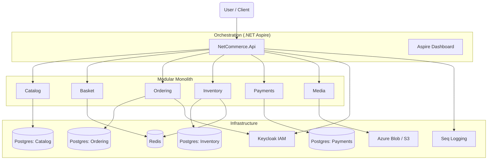

# NetCommerce 🛒

[](https://dotnet.microsoft.com/)
[](https://learn.microsoft.com/en-us/dotnet/aspire/)
[](https://github.com/kgrzybek/modular-monolith-with-ddd)
[](LICENSE)

> **A production-ready E-Commerce Modular Monolith built with .NET 10 (Preview) and .NET Aspire.**

NetCommerce is a reference implementation demonstrating how to build a highly scalable, maintainable, and distributed-ready application using the "Modular Monolith First" strategy. It leverages Domain-Driven Design (DDD), CQRS, Clean Architecture, and advanced distributed patterns.

---

## 🏗️ Architecture

The system is composed of loosely coupled modules communicating via in-process **MediatR** commands/queries and **Integration Events** (using an in-memory bus that bridges domain events to other modules).

### 🧩 System Overview



### 📦 Bounded Contexts (Modules)

| Module | Responsibility | Storage Strategy | Key Patterns |
|:---|:---|:---|:---|
| **Catalog** | Product management, Categories, Full-Text Search. | `CatalogDb` (Postgres) | CQRS, Read/Write split, Caching Decorators |
| **Basket** | Temporary shopping cart management. | Redis | Key-Value Store, TTL Expiry |
| **Ordering** | Order lifecycle, validation, and history. | `OrderingDb` (Postgres) | **Transactional Outbox**, Price Snapshotting, State Machine |
| **Inventory** | Stock tracking, reservations, low-stock alerts. | `InventoryDb` (Postgres) | **RedLock** (Distributed Lock), **Soft Reservations**, Background Cleanup Jobs |
| **Payments** | Payment processing (Stripe), ledger, refunds. | `PaymentsDb` (Postgres) | Gateway Abstraction, Compensating Transactions, Idempotency |
| **Media** | File uploads and CDN URL generation. | Azure Blob / S3 | Presigned URLs, Secure Uploads |

---

## 🚀 Quick Start

### Prerequisites
*   **.NET 10 SDK** (Preview)
*   **Docker Desktop** (Required for Aspire containers)
*   **Visual Studio 2022** (Preview) or **VS Code**

### Running the Solution

This project uses **.NET Aspire** to orchestrate all infrastructure dependencies (Postgres, Redis, Keycloak, Seq, etc.) automatically. You do **not** need to manually run `docker-compose`.

1.  **Clone the repository:**
    ```bash
    git clone https://github.com/your-username/nikanats-netcommerce.git
    cd nikanats-netcommerce
    ```

2.  **Trust the development certificate:**
    ```bash
    dotnet dev-certs https --trust
    ```

3.  **Run the AppHost:**
    ```bash
    dotnet run --project src/NetCommerce.AppHost/NetCommerce.AppHost.csproj
    ```

4.  **Access the Environment:**
    *   **Aspire Dashboard:** `https://localhost:17225` (Check console output for exact port)
    *   **Swagger UI:** `{API_URL}/swagger` (Log in using Keycloak via Swagger's Authorize button)
    *   **Keycloak Admin:** `http://localhost:8080`
    *   **pgAdmin:** `http://localhost:5050`
    *   **Seq:** `http://localhost:5341`

---

## 🔐 Authentication & Security

Identity management is handled by **Keycloak**. The solution automatically imports the `netcommerce` realm with pre-configured users and roles.

### Pre-configured Test Users

| Role | Username | Password | Permissions |
|:---|:---|:---|:---|
| **Admin** | `admin@netcommerce.com` | `Admin123!` | Full Access, Global Settings |
| **Vendor** | `vendor@netcommerce.com` | `Vendor123!` | Manage Products, Inventory, Media |
| **Customer**| `customer@netcommerce.com`| `Customer123!`| Browse Catalog, Basket, Checkout |

> **Note:** The API enforces Role-Based Access Control (RBAC). For example, only **Vendors** can create products, and only **Customers** can place orders.

---

## 🛠️ Technical Implementation Details

### 1. Transactional Outbox Pattern
We use the Outbox pattern to guarantee eventual consistency between modules.
*   **Write Side:** When an entity is saved (e.g., `Order`), domain events are serialized and saved to an `OutboxMessages` table in the *same transaction*.
*   **Processor:** A background worker (`OutboxProcessor`) polls using `SELECT FOR UPDATE SKIP LOCKED` to process messages concurrently without race conditions.
*   **Dead Letter:** Failed messages are retried (exp. backoff) and moved to a dead-letter state if they permanently fail.

### 2. Inventory Concurrency (RedLock)
To prevent overselling during high-concurrency events (like a PS5 launch), the Inventory module uses **RedLock** (via Redis) to serialize access to specific stock items during the reservation phase.
```csharp
// Example from ReserveStockCommandHandler.cs
await using var lock = await _lockService.TryAcquireLockAsync(
    resource: $"stock:reserve:{productId}",
    expiryTime: TimeSpan.FromSeconds(30), ...);
```

### 3. Soft Reservations
Stock is not deducted immediately upon adding to the cart or checkout start.
*   **Reserve:** Creates a `StockReservation` record valid for **15 minutes**.
*   **Confirm:** Deducts actual quantity upon successful payment.
*   **Cleanup:** A background job (`ReservationCleanupJob`) runs every minute to release expired reservations back to the available pool.

### 4. Idempotency
Critical mutation endpoints (e.g., `POST /orders`, `POST /payments`) implement idempotency via the `X-Idempotency-Key` header.
*   Requests are cached in Redis.
*   Duplicate requests with the same key return the *original* response without re-executing logic.

### 5. Price Snapshotting
When an Order is created, we capture the **Applied Price** and **Applied Title** of the product at that exact moment. This ensures that future price/name changes in the Catalog module do not corrupt historical order data.

---

## 🧪 Testing Strategy

The solution includes a comprehensive testing pyramid:

| Project | Type | Description |
|:---|:---|:---|
| `NetCommerce.Domain.Tests` | **Unit** | Tests aggregates, value objects, and domain logic (e.g., `Stock.Reserve`). Uses **Bogus** for data generation. |
| `NetCommerce.Architecture.Tests` | **Architecture** | Enforces Clean Architecture rules using **NetArchTest**. Ensures Domain layers do not depend on Infrastructure or ASP.NET Core. |
| `NetCommerce.Integration.Tests` | **Integration** | Uses **Testcontainers** (Postgres/Redis) and **Respawn** to test repositories and EF Core commands against real databases. Includes **WireMock.Net** for payment gateway simulation. |
| `NetCommerce.LoadTests` | **Load** | Uses **NBomber** to simulate high-traffic scenarios like "Flash Sales" and "Stock Concurrency" to verify locking mechanisms. |

**Run all tests:**
```bash
dotnet test
```

---

## 📂 Project Structure

```text
nikanats-netcommerce/
├── src/
│   ├── Api/                      # API Host (Minimal APIs)
│   ├── NetCommerce.AppHost/      # .NET Aspire Orchestrator
│   ├── NetCommerce.ServiceDefaults/ # Aspire shared config (OpenTelemetry, etc.)
│   ├── Shared/                   # Shared Kernel (Abstractions, Base Classes)
│   │
│   ├── Catalog/                  # [Module] Products & Categories
│   ├── Basket/                   # [Module] Redis Shopping Cart
│   ├── Ordering/                 # [Module] Order Management
│   ├── Inventory/                # [Module] Stock & Reservations
│   ├── Payments/                 # [Module] Stripe Integration
│   └── Media/                    # [Module] Azure Blob/S3 Storage
│
└── tests/                        # Unit, Arch, Integration & Load Tests
```

---

## 🔮 Scalability Roadmap

The current architecture is a **Modular Monolith**. It is designed to be easily split into microservices if scaling requirements demand it.

1.  **Phase 1 (Current):** Single deployment unit, modules separated by namespaces/assemblies, communicating via in-memory MediatR.
2.  **Phase 2 (Async Messaging):** Replace in-memory event bus with **RabbitMQ** or **Azure Service Bus** (Outbox processor supports this switch easily).
3.  **Phase 3 (Extraction):** Isolate a "hot" module (e.g., Inventory) into a separate container/service without rewriting domain logic.

---

## 📜 License

This project is licensed under the **MIT License**.
```