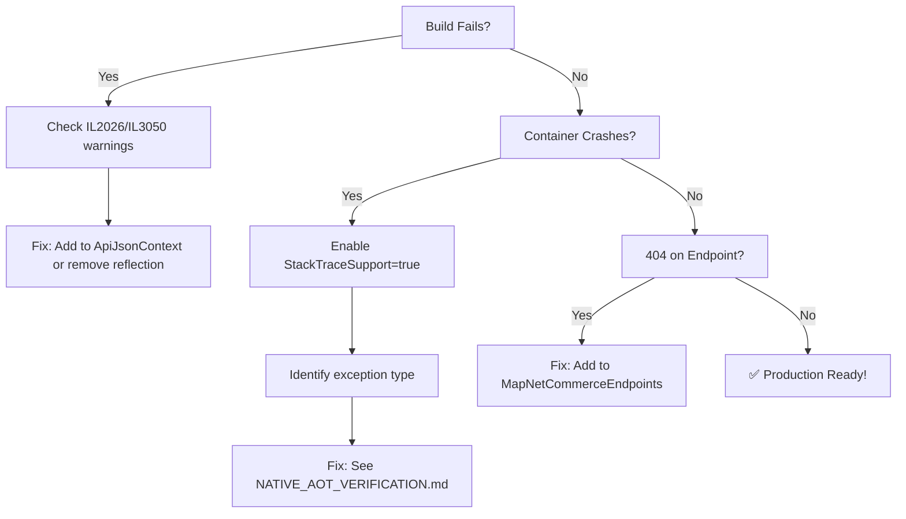

# Native AOT Verification - Quick Reference

## TL;DR - Run This

```powershell
# Automated verification (recommended)
.\scripts\Verify-NativeAOT.ps1

# Manual verification
dotnet publish src/Api/NetCommerce.Api.csproj -c Release -p:PublishAot=true
docker build -t netcommerce-aot -f src/Api/Dockerfile .
docker run --rm -p 8080:8080 netcommerce-aot
curl http://localhost:8080/health/ready
```

## 5 Critical Checkpoints

| # | Name | Command | Pass Criteria |
|---|------|---------|---------------|
| 1️⃣ | **Build Warnings** | `dotnet publish -p:PublishAot=true` | Zero IL2026/IL3050 in critical paths |
| 2️⃣ | **Wolverine Codegen** | `dotnet run -- codegen write` | Handler .cs files exist OR TypeLoadMode.Auto configured |
| 3️⃣ | **Image Size** | `docker images netcommerce-aot` | < 100 MB (Native AOT + chiseled) |
| 4️⃣ | **Startup** | `docker run netcommerce-aot` | "Now listening" in < 100ms |
| 5️⃣ | **Functional** | `curl http://localhost:8080/api/v1/products` | 200 OK with JSON |

## Common Failures & Fixes

### ❌ IL2026: RequiresUnreferencedCode

**Symptom:** Warning during publish
**Cause:** Using reflection (Assembly.GetTypes, Activator.CreateInstance)
**Fix:** Replace with explicit registration or add `[DynamicallyAccessedMembers]`

### ❌ MissingMethodException at Runtime

**Symptom:** Crash on startup with "Method not found"
**Cause:** Trimmer removed method used via reflection
**Fix:** Add `[DynamicDependency]` or use explicit type references

### ❌ JsonException: Cannot get metadata

**Symptom:** Crash during API call
**Cause:** DTO not registered in `ApiJsonContext`
**Fix:** Add `[JsonSerializable(typeof(YourDto))]` to ApiJsonContext.cs

### ❌ 404 Not Found on Endpoint

**Symptom:** Endpoint returns 404
**Cause:** Endpoint class trimmed (not referenced in explicit registration)
**Fix:** Add endpoint to `MapNetCommerceEndpoints()` in EndpointRegistrationExtensions.cs

### ❌ Image Size > 200 MB

**Symptom:** Docker image too large
**Cause:** Using JIT runtime base image
**Fix:** Verify Dockerfile uses `runtime-deps:chiseled` base image

## Performance Targets

| Metric | Native AOT Target | JIT Baseline |
|--------|-------------------|--------------|
| **Container Size** | < 100 MB | ~230 MB |
| **Cold Start** | < 100 ms | ~2.5 s |
| **Memory (Idle)** | < 120 MB | ~180 MB |
| **Memory (Load)** | < 300 MB | ~450 MB |
| **Throughput** | > 8,000 req/s | ~7,200 req/s |

## Troubleshooting Workflow



## Phase Completion Status

- ✅ Phase 1: Native AOT Foundation (PublishAot=true)
- ✅ Phase 2: MVC Purge (Minimal APIs only)
- ⏸️ Phase 3: EF Core Compiled Models (deferred)
- ✅ Phase 4: Wolverine Source Generation (TypeLoadMode.Auto)
- ✅ Phase 5: JSON Source Generation (ApiJsonContext)
- ✅ Phase 6: Zero-Reflection Endpoints (explicit registration)
- ✅ Phase 7: Production Dockerfile (chiseled runtime)
- 🔄 **Phase 8: Verification (YOU ARE HERE)**

## Next Steps After Verification Passes

1. **Load Testing:** Run `NetCommerce.LoadTests` to stress-test
2. **CI/CD:** Add Docker build to GitHub Actions
3. **Production Deploy:** Deploy to Kubernetes with HPA
4. **Monitoring:** Configure OpenTelemetry with AOT-compatible exporters

## References

- 📖 [Full Verification Guide](./NATIVE_AOT_VERIFICATION.md) - Detailed troubleshooting
- 🐳 [Docker Build Guide](./NATIVE_AOT_DOCKER_BUILD.md) - Build process explained
- 🔧 [Verification Script](../scripts/Verify-NativeAOT.ps1) - Automated testing
- 📚 [Microsoft Native AOT Docs](https://learn.microsoft.com/en-us/dotnet/core/deploying/native-aot/)

---

**Last Updated:** Phase 7 Complete - February 4, 2026
